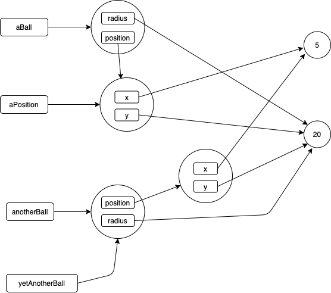

# Values and Objects 

## Script / Outline

1. Variable declaration and initiation
2. Values: Integer, Double, Char, String, Boolean
3. Operations with values (e.g. arithmetic, logic)
4. Objects:
   1. Composing values
   2. Composing data (values and objects)
5. A mental model for data representation

## Exercises    
1. Consider the following program:
   1. What is the value of the expression `aBall.radius` ?
   2. Draw a diagram of the existing variables, values and objects

    ```kotlin
    fun main() {
      val aRadius = 15
      val aBall = object { 
        val x = 20
        val y = 20
        val radius = aRadius 
      }
      // ... oher stuff not relevant for the question
    }
    ```

2. Consider the next program:    
    1. Which of the following expressions evaluate to `5` ?
        * `aPosition`
        * `aPosition.x`
        * `aBall`
        * `aBall.x`
        * `aBall.position.x`
    2. Draw a diagram of the existing variables, values and objects

    ```kotlin
    fun main() {
      val aPosition = object { val x = 5; val y = 20 }
      val aBall = object { 
        val position = aPosition
        val radius = 15 
      }
      // ... oher stuff not relevant for the question
    }
    ```
3. Consider the following diagram of a program's variables, values and objects. Write the code that declares the depicted elements. 

