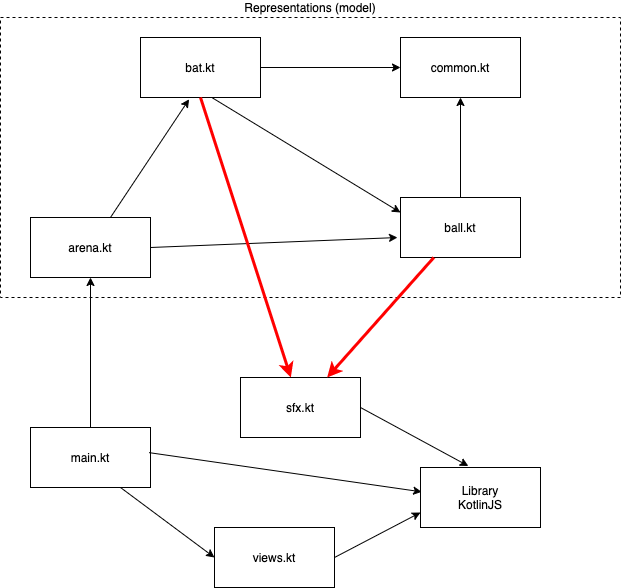

# Basic principles of software design

## Script / Outline (120 mins) ([video](https://www.youtube.com/watch?v=3rAY-DEqX7Q&list=PL8XxoCaL3dBiJ_djQKKbbI4uN081F7Sgw&index=18))
1. Mental constructs for dealing with complexity
   1. Dependency management:
      1. What is a dependency? ([check it here](https://www.uml-diagrams.org/dependency.html))
      2. Why is it important?
      3. Important take away: __Make dependencies explicit!__
   2. [Information hidding](https://en.wikipedia.org/wiki/Information_hiding)
      1. What is it?
      2. Why is it important?
      3. [Visibility of Kotlin's top level constructs](https://kotlinlang.org/docs/reference/visibility-modifiers.html#visibility-modifiers)
2. Principles of software design: introduction
   1. Do not Repeat Yourself ([DRY](https://wiki.c2.com/?DontRepeatYourself))
   2. Single Responsibility Principle ([SRP](https://blog.cleancoder.com/uncle-bob/2014/05/08/SingleReponsibilityPrinciple.html))
3. Demos: 
   1. Review current design of Pong, fixing it it needed
   2. Adding sound to Pong: 
      1. Can we do it without breaking our design?
      2. To be considered:
         1. How to play sounds? 
         2. And, most importantly, __when__ and __where__ should we play them?

## Pong design considerarions:
1. The solution is divided into two groups of code artifacts:
   1. Those that are _independent_ of the target (e.g. browser or JVM);
   2. Those that are _dependent_ of the runtime environment, in our case, the browser.
2. Representations used for the purpose of computation, for example for computing ball deflections, do not need to be target dependent. These representations are usually named _models_. Models (and associated computations) are _always_ separated from artifacts that are pertaining to the user interaction, which is dependent of the runtime environment. These artifacts are usually collectively named _views_;
3. Models are immutable and all associated functions are pure and therefore do not produce side-effects;
4. User interaction related artifacts (the UI) is mostly composed of effects;
5. Dependencies from _models_ to _views_, or any other artifacts that are dependent of the runtime environment as it is the case of primitives for playing sound effects, are _forbidden_. (This is how an architectural constraint usually looks like).

Our current solution breaks this design. The rogue dependencies are represented by red arrows in the following diagram. 
We need to do better... (_coming soon_)

