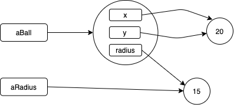
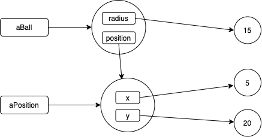

# Values and Objects 

## Exercises solutions
1. Consider the following program:
    ```kotlin
    fun main() {
      val aRadius = 15
      val aBall = object { 
        val x = 20
        val y = 20
        val radius = aRadius 
      }
      // ... oher stuff not relevant for the question
    }
    ```
   1. What is the value of the expression `aBall.radius` ? Answer: `15`

   2. Draw a diagram of the existing variables, values and objects (the program's state)
   
      Answer:   
      

2. Consider the next program:    
    ```kotlin
    fun main() {
      val aPosition = object { val x = 5; val y = 20 }
      val aBall = object { 
        val position = aPosition
        val radius = 15 
      }
      // ... oher stuff not relevant for the question
    }
    ```
    1. Which of the following expressions evaluate to `5` ? Answer (wrong answers are ~~strikethrough~~)
        * ~~`aPosition`~~
        * `aPosition.x`
        * ~~`aBall`~~
        * ~~`aBall.x`~~
        * `aBall.position.x`
    2. Draw a diagram of the existing variables, values and objects (the program's state)

        Answer:   
        

3. Consider the following diagram of a program's state. Write the code that creates the depicted elements. 

    

    Answer: 

    ```kotlin
    fun main() {
      val aPosition = object { val x = 5; val y = 20 }
      val aBall = object { val position = aPosition; val radius = 20 }
      
      val anotherBall = object {
          val position = object { val x = 5; val y = 20 }
          val radius = 20
      }
      // ... oher stuff not relevant for the question
    }
    ```
 
