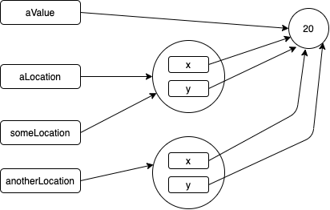

# Identity and Equivalence 

## Exercises solutions
1. Consider the following program:
    ```kotlin
    data class Location(val x: Int, val y: Int)

    fun main() {
        val aValue = 20
        val aLocation = Location(aValue, 20)
        val anotherLocation = Location(20, 20)
        val someLocation = aLocation

        // ... other stuff not relevant to the question
    }
    ```
   1. Draw a diagram of the existing variables, values and objects (the program's state)   
      __Answer:__   
      

   2. What is the value of each of the following expressions?   
      
      **Answers:** 
      * `aValue == aLocation.x` --> `true`
      * `aValue === aLocation.x` --> `true`
      * `aLocation.x != aLocation.y` --> `false`
      * `aLocation.x !== aLocation.y` --> `false`
      * `anotherLocation == aLocation` --> `true`
      * `anotherLocation === aLocation` --> `false`
      * `someLocation == aLocation` --> `true`
      * `someLocation === aLocation` --> `true`
      
  
2. Consider the following program:    
    ```kotlin
    data class Location(val x: Int, val y: Int)
    data class Ball(val center: Location, val radius: Int)

    fun main() {
      val aLocation = Location(20, 20)
        val aBall = Ball(aLocation, 15)
        val anotherBall = Ball(aLocation, 15)
        val yetAnotherBall = Ball(Location(20, 20), 15)

        // ... other stuff not relevant to the question   
    }
    ```    
    1. What is the value of each of the following expressions?   
        
        __Answer:__
         * `aBall.center == anotherBall.center` --> `true`
         * `aBall.center === anotherBall.center` --> `true`
         * `aBall.center == yetAnotherBall.center` --> `true`
         * `aBall.center === yetAnotherBall.center` --> `false`  
      

    2. Consider the type definitions `Location` and `Ball` of the previous program. For two arbitrary `Ball` instances, referred by variables `ball1` and `ball2`, what is the expression that evaluates to `true` whenever the two instance's centers have the same coordinates?

        __Answer:__   
        Cheking if any two `Ball` instances have their centers at the same coordinates requires the use of structural equality (a.k.a equivalence), like this: `ball1 == ball2`. The use of referential equality would produce incorrect results.  
 